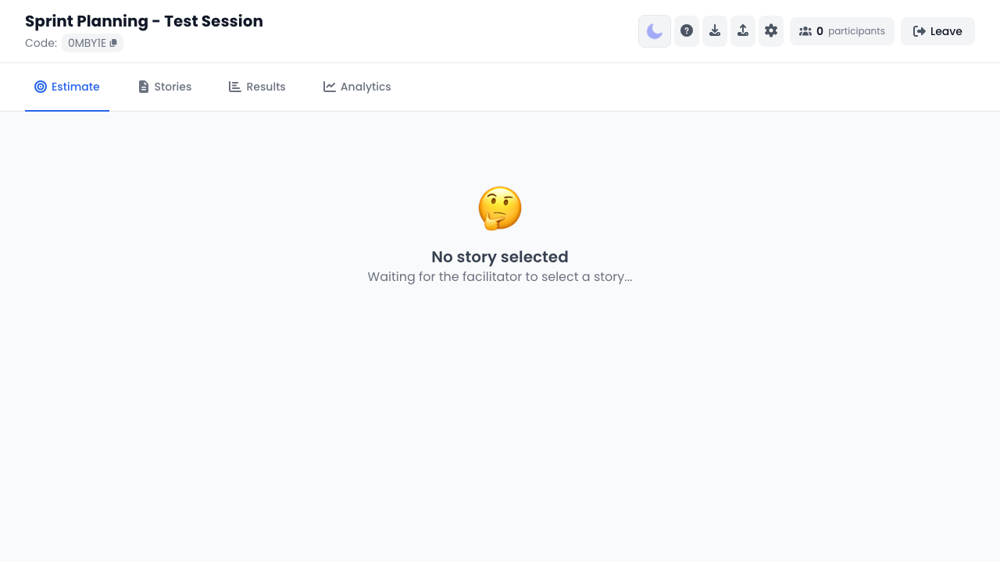
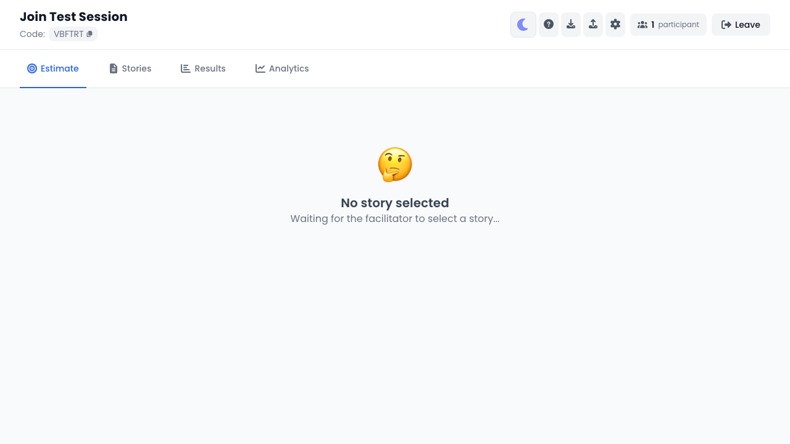
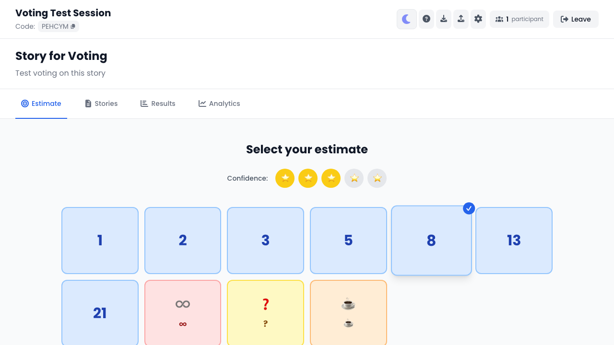
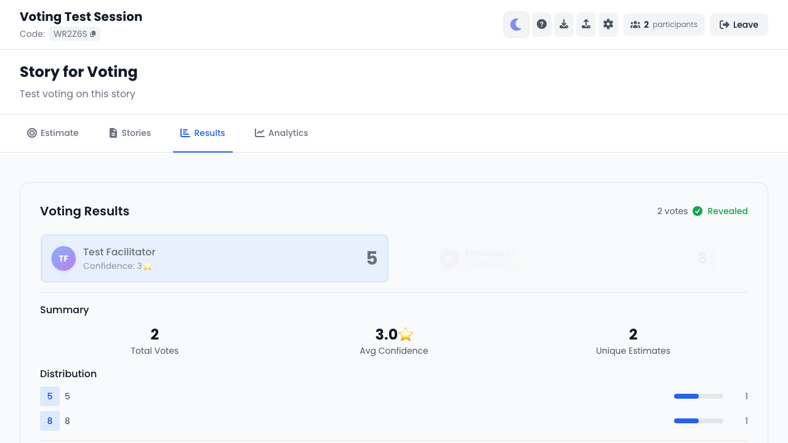
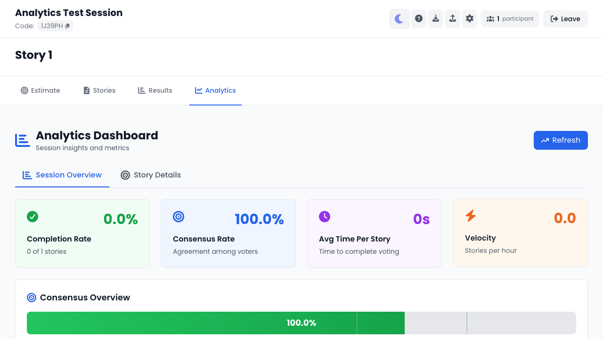
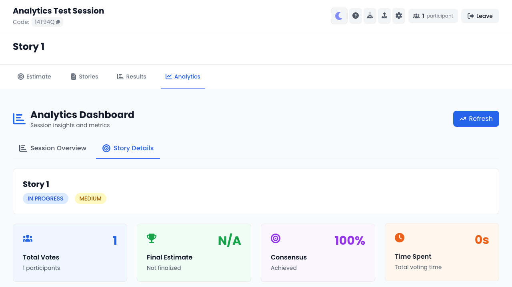

# EstiMate

<p align="center">
  
</p>

Real-time collaborative story estimation for agile teams.

## ✨ Features

### 🎯 Flexible Estimation Methods
- **Fibonacci Sequence** (1, 2, 3, 5, 8, 13, 21, ...)
- **T-Shirt Sizes** (XS, S, M, L, XL, XXL)
- **Powers of 2** (1, 2, 4, 8, 16, 32, ...)
- **Linear Scale** (1, 2, 3, 4, 5, 6, ...)
- **Custom Values** - Define your own scale

### 🚀 Real-Time Collaboration
- Live participant updates via WebSocket
- Instant vote synchronization
- Real-time voting status indicators
- Session sharing with 6-character codes

### 📊 Comprehensive Analytics
- Voting distribution charts
- Consensus indicators
- Story-specific metrics
- Average, min, max calculations
- Export session data (JSON/CSV)

### 📝 Story Management
- Create and manage user stories
- Story backlog organization
- Activate stories for voting
- Finalize estimates
- Track voting history

## Tech Stack

**Backend:** Spring Boot 3.2.0, Java 21, H2 Database, WebSocket  
**Frontend:** React 18, Vite, TailwindCSS, Framer Motion

## Quick Start

**Prerequisites:** Java 21+, Node.js 18+, Maven

```bash
# Backend
cd backend
mvn spring-boot:run
# API: http://localhost:8080
# Swagger UI: http://localhost:8080/swagger-ui.html

# Frontend
cd frontend
npm install && npm run dev
# App: http://localhost:5173
```

## 📸 Screenshots

### Session Dashboard


*Collaborative planning poker session with real-time participant tracking*

### Voting Interface


*Interactive estimation cards with Fibonacci sequence*

### Results & Analytics
<table>
  <tr>
    <td width="50%">
      
      <p align="center"><em>Vote reveal with detailed statistics</em></p>
    </td>
    <td width="50%">
      
      <p align="center"><em>Analytics dashboard with consensus tracking</em></p>
    </td>
  </tr>
</table>

### Voting Distribution


*Visual breakdown of team voting patterns*

---

## 🏗️ Project Structure

```
├── backend/          # Spring Boot API
├── frontend/         # React UI
├── api-testing/      # Newman API tests (38 tests)
├── e2e-tests/        # Playwright E2E tests (24 tests)
└── screenshots/      # Feature screenshots
```

## Usage

1. Create session with sizing method
2. Share 6-character code with team
3. Add stories to backlog
4. Vote on estimates
5. Reveal and finalize

## Testing

**API Tests (Newman/Postman):**
```bash
cd api-testing
./run-tests.sh
```

**E2E Tests (Playwright):**
```bash
cd e2e-tests
./run-tests.sh
```

## Documentation

- [Future Features & Roadmap](FUTURE_FEATURES.md)
- [Backend Documentation](backend/README.md)
- [Frontend Documentation](frontend/README.md)
- [API Testing Guide](api-testing/README.md)
- [E2E Testing Guide](e2e-tests/README.md)

## License

MIT
