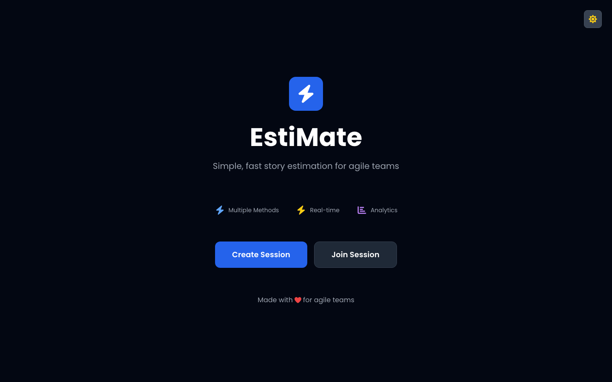
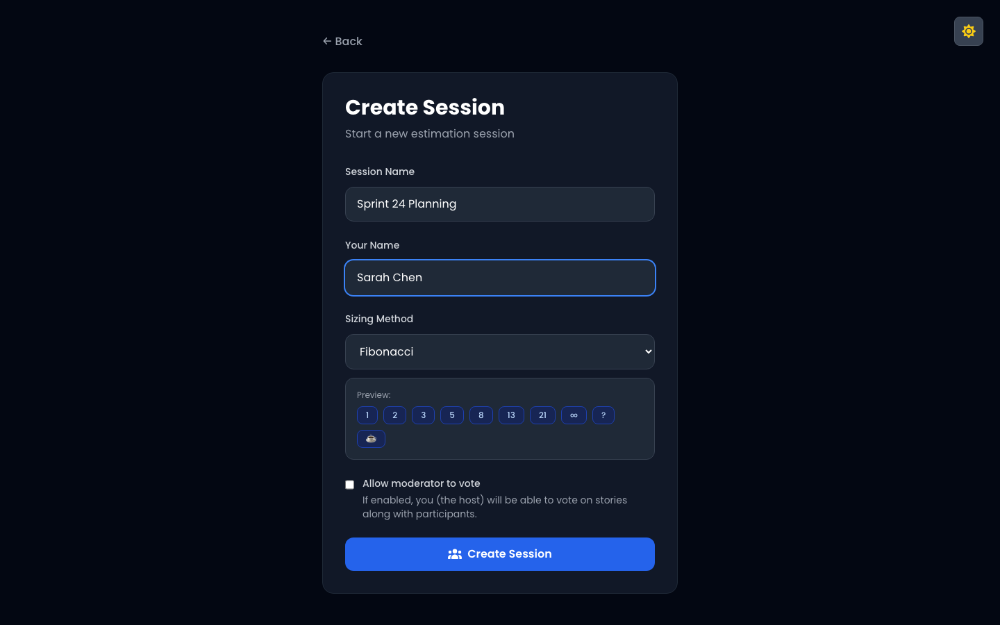
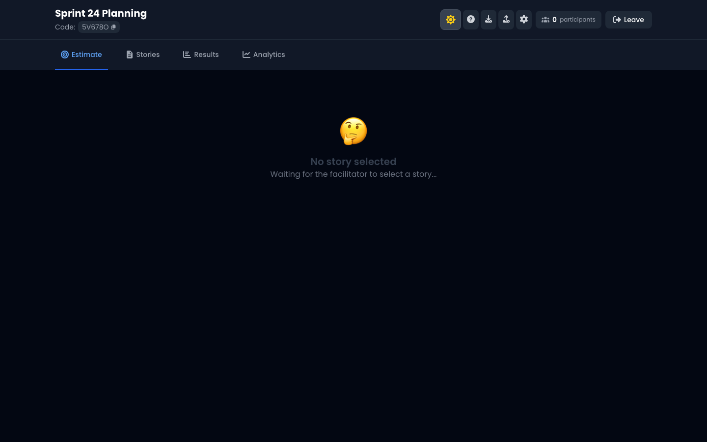
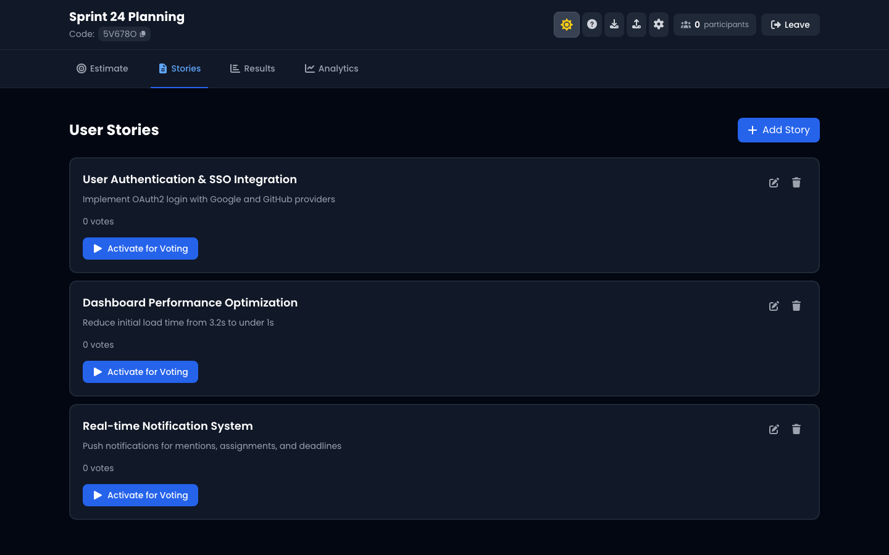
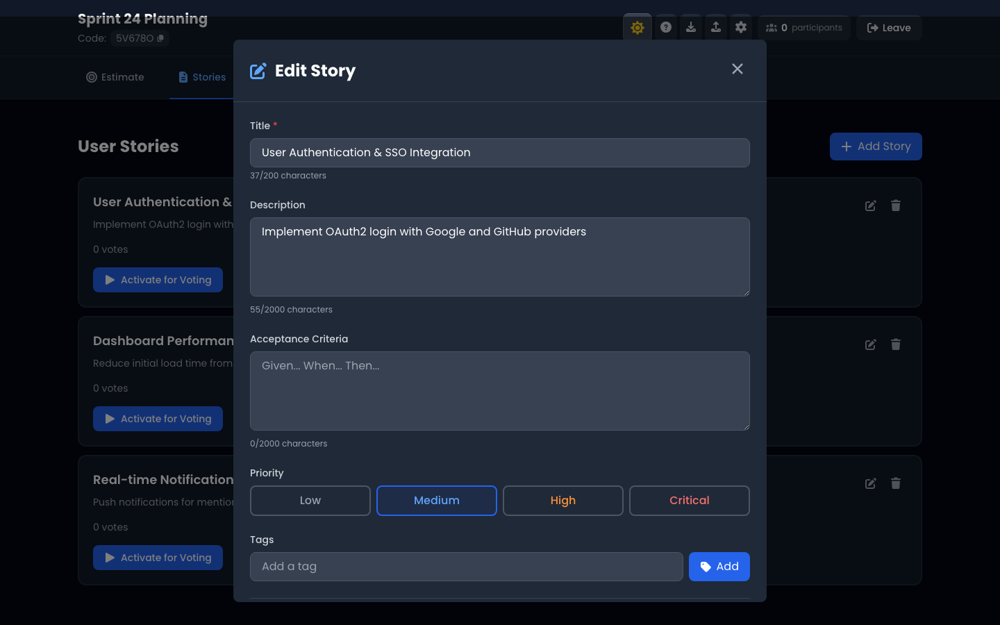
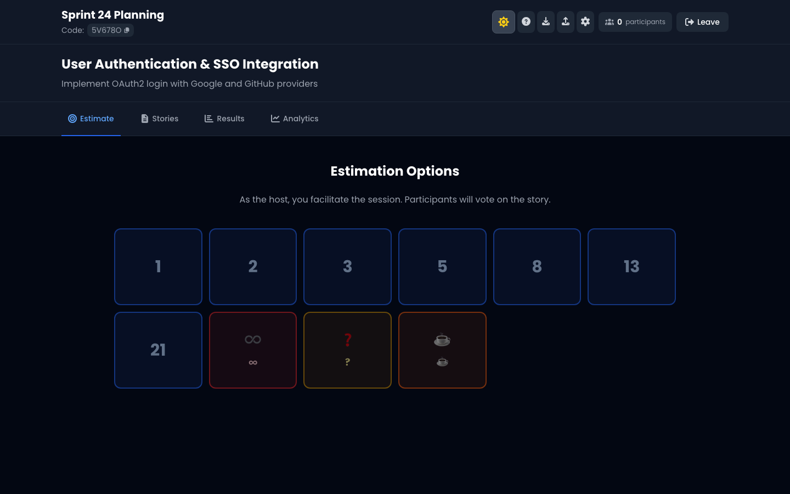
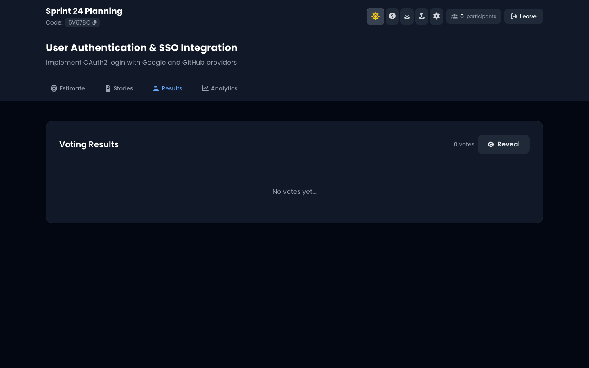
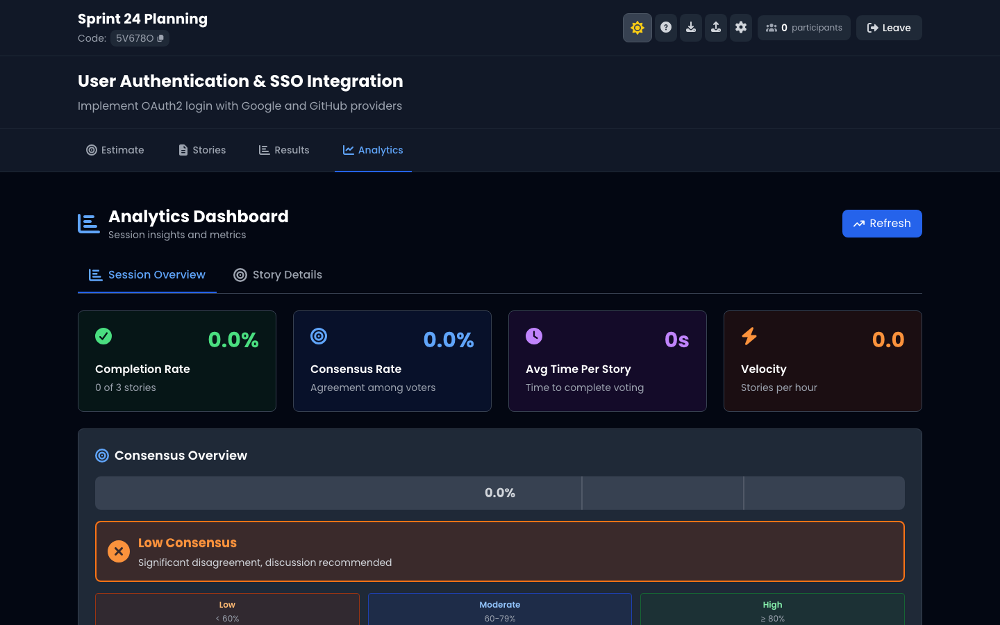
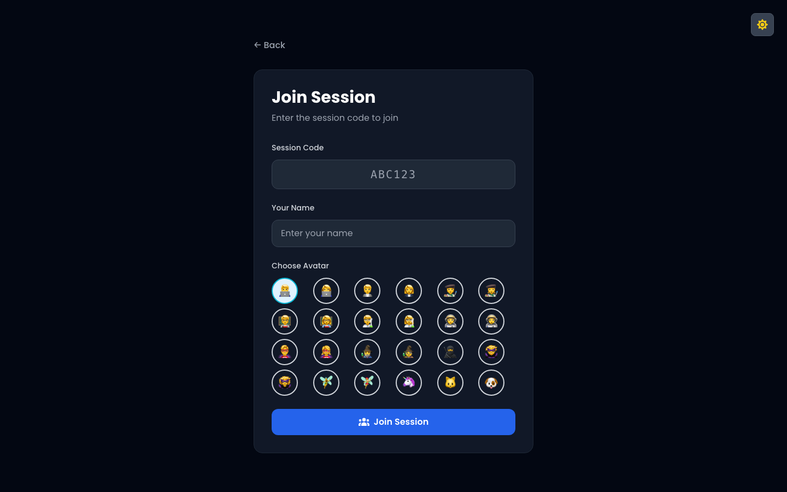
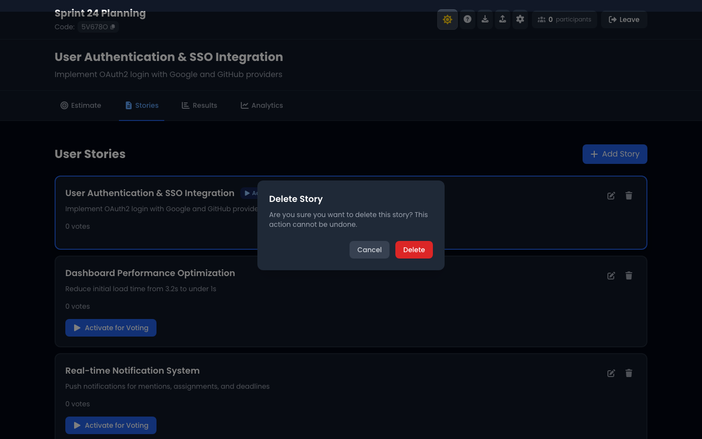

# EstiMate

<p align="center">
  
</p>

Simple, fast story estimation for agile teams. Built with real-time collaboration, dark mode, and comprehensive analytics.

---

## ✨ Features

### 🎯 Flexible Estimation Methods
- **Fibonacci Sequence** (1, 2, 3, 5, 8, 13, 21, ...)
- **T-Shirt Sizes** (XS, S, M, L, XL, XXL)
- **Powers of 2** (1, 2, 4, 8, 16, 32, ...)
- **Linear Scale** (1, 2, 3, 4, 5, 6, ...)
- **Custom Values** — Define your own scale

### 🚀 Real-Time Collaboration
- Live participant updates via WebSocket
- Instant vote synchronization
- Real-time voting status indicators
- Session sharing with 6-character codes
- Avatar selection for participants

### 📊 Comprehensive Analytics
- Voting distribution charts
- Consensus indicators (Low / Moderate / High)
- Session overview with completion rate, velocity, average time per story
- Story-specific metrics and details
- Export session data (JSON / CSV)

### 📝 Story Management
- Full CRUD — create, edit, and delete stories (moderator only)
- Story backlog with priority levels and tags
- Activate stories for voting
- Finalize estimates
- Track voting history per story

### 🌙 Dark Mode
- System-aware dark/light theme toggle
- Persistent preference via localStorage

### ♿ Accessibility
- ARIA labels on all interactive elements
- Keyboard-navigable modals, tabs, and dialogs
- Screen reader support with `role` and `aria-*` attributes

### ⏱️ Voting Timer
- Configurable countdown timer per story
- Responsive timer controls for mobile

---

## Tech Stack

| Layer | Technology |
|-------|-----------|
| **Backend** | Spring Boot 3.5, Java 21, H2 Database, WebSocket, Flyway |
| **Frontend** | React 19, Vite 7, TailwindCSS, Framer Motion |
| **Testing** | JUnit 5, Mockito, Newman/Postman, Playwright |
| **CI** | GitHub Actions |

---

## Quick Start

**Prerequisites:** Java 21+, Node.js 18+, Maven

```bash
# Backend
cd backend
mvn spring-boot:run
# API: http://localhost:8080
# Swagger UI: http://localhost:8080/swagger-ui.html

# Frontend
cd frontend
npm install && npm run dev
# App: http://localhost:5173
```

Or use Docker:

```bash
docker-compose up
```

---

## 📸 Screenshots

All screenshots captured in **dark mode**.

### Home Page


*Landing page with Create Session and Join Session options*

### Create Session


*Configure session name, sizing method (Fibonacci, T-Shirt, etc.), and moderator voting preference*

### Session Dashboard


*Main session view with Estimate, Stories, Results, and Analytics tabs*

### Story Backlog


*Manage user stories with edit, delete, and activate-for-voting controls*

### Edit Story


*Edit story details — title, description, acceptance criteria, priority, and tags*

### Voting Cards


*Fibonacci estimation cards with color-coded special values*

### Vote Cast


*Active voting session with selected estimate card*

### Voting Results


*Results tab with vote count and reveal button*

### Analytics Dashboard


*Session analytics — completion rate, consensus rate, velocity, and time metrics*

### Join Session


*Join with session code, name, and avatar selection*

### Delete Confirmation


*Confirmation dialog before deleting a story*

---

## 🏗️ Project Structure

```
├── .github/workflows/ # CI pipeline (GitHub Actions)
├── backend/           # Spring Boot API
├── frontend/          # React UI
├── api-testing/       # Newman API tests (47 requests, 83 assertions)
├── e2e-tests/         # Playwright E2E tests (46 tests)
├── learn/             # Learning guides (backend + frontend)
├── screenshots/       # Dark mode feature screenshots
└── docker-compose.yml # Docker setup
```

---

## Usage

1. **Create** a session — pick a sizing method (Fibonacci, T-Shirt, etc.)
2. **Share** the 6-character code with your team
3. **Add stories** to the backlog with priority and tags
4. **Activate** a story and vote on estimates
5. **Reveal** votes — see distribution, average, and consensus
6. **Analyze** session metrics on the Analytics tab
7. **Export** results as JSON or CSV

---

## Testing

### Backend Unit Tests (73 tests)

```bash
cd backend
mvn test
```

### API Tests — Newman/Postman (47 requests, 83 assertions)

```bash
cd api-testing
./run-tests.sh
```

### E2E Tests — Playwright (46 tests)

```bash
cd e2e-tests
./run-tests.sh
```

### CI Pipeline

Tests run automatically on push/PR via GitHub Actions. See [.github/workflows/test.yml](.github/workflows/test.yml).

---

## Documentation

- [Backend Documentation](backend/README.md)
- [Frontend Documentation](frontend/README.md)
- [API Testing Guide](api-testing/README.md)
- [E2E Testing Guide](e2e-tests/README.md)
- [Future Features & Roadmap](FUTURE_FEATURES.md)

### Learning Guides

- [Backend Guides](learn/backend/README.md) — Spring Boot, REST, JPA, Security, WebSockets, Testing
- [Frontend Guides](learn/frontend/README.md) — React, Hooks, Context, Routing, TailwindCSS, Accessibility

---

## License

MIT
